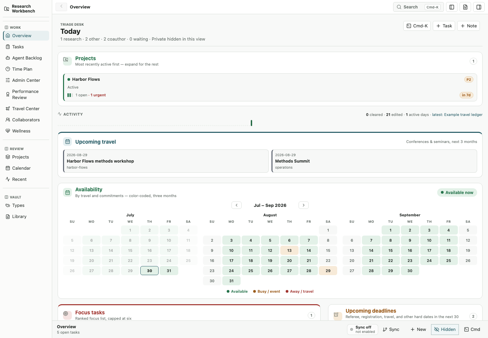

# Research Workbench

Research Workbench is a configurable, Markdown-first project manager for
research. This repository is named `markdown-task-manager` for continuity; the
application and interface are called **Research Workbench**.

Projects, tasks, notes, dates, plans, and module records stay as ordinary
Markdown with YAML frontmatter. The application adds a searchable dashboard,
editing, planning, visual summaries, and optional synchronization without
turning the vault into a proprietary database.



## Features

- Tasks, projects, notes, calendar, boards, graph, and time planning
- Admin, travel, collaborator/RA, wellness, performance-review, and scholar
  metrics modules
- Markdown editing, KaTeX math, wiki links, aliases, and backlinks
- Vault-local application name, owner aliases, module labels, and domain rules
- Deterministic static views under `<vault>/.generated`
- Optional GitHub synchronization, disabled by default and dry-run-first
- Local Python/Node operation and Docker-based private self-hosting

All examples are synthetic. No personal vault, private Git history, generated
dashboard, correspondence, calendar, health record, travel plan, collaborator
record, or binary document belongs in this repository.

## Five-minute start

Requirements: Python 3.11+, Node.js 22+, npm, and Git.

```bash
git clone https://github.com/sfuchs-de/markdown-task-manager.git
cd markdown-task-manager
make setup
make init
```

Run the API and web application in separate terminals:

```bash
make api
make web
```

Open [http://127.0.0.1:5173](http://127.0.0.1:5173). To use an existing vault:

```bash
PM_VAULT_ROOT="/absolute/path/to/vault" make api
```

Useful checks:

```bash
make doctor
make qa
make test-e2e
```

`python scripts/pm.py init --vault <path>` refuses to overwrite a nonempty
directory. `PM_OUTPUT_ROOT` defaults to `<vault>/.generated`.

## Configuration

The starter vault includes `settings/workbench.yml`. It controls the
application name, owner aliases, enabled modules, custom module labels, domain
labels, metadata-based classification rules, and an optional scholar-statistics
source.

Frontmatter is the primary classifier:

```markdown
---
kind: task
id: estimate-baseline
title: Estimate the baseline
status: active
domain: research
area: modeling
project: harbor-flows
priority: 1
due: 2026-09-30
deadline_type: soft
assignee: Owner
---
```

Unmatched entries are assigned to `other`; project names are not hidden
classification rules. See [Vault format](docs/VAULT_FORMAT.md),
[Configuration](docs/CONFIGURATION.md), and [Modules](docs/MODULES.md).

## Docker

```bash
make init
docker compose up --build
```

Compose binds only to `127.0.0.1:8765`, mounts the writable vault at `/vault`,
and runs the container as a non-root user. For access from another machine,
set a strong `PM_APP_TOKEN`, use TLS, and put the service behind an
access-controlled network boundary. There is no public hosted demo.

See [Docker and private hosting](docs/DOCKER.md).

## Privacy boundary

`private: true` is a display filter, **not encryption or access control**.
The bearer token is not a multi-user identity system. Keep the vault on
encrypted storage, use an access-controlled network for remote instances, and
review any static export before sharing it.

GitHub synchronization is off unless explicitly enabled. If used, point it at
a separate private vault repository. Read [Privacy and security](docs/PRIVACY.md)
and [GitHub synchronization](docs/GITHUB_SYNC.md) first.

## Documentation

- [CLI](docs/CLI.md)
- [Architecture](docs/ARCHITECTURE.md)
- [Backup and restore](docs/BACKUP_RESTORE.md)
- [Upgrading](docs/UPGRADING.md)
- [Contributing](CONTRIBUTING.md) and [security policy](SECURITY.md)

## Status and support

Version `1.x` is self-hosted software. Interfaces may change between minor
releases; tagged releases and the changelog document migrations. This is
a community-supported project with no uptime or response-time guarantee.
Use GitHub Issues for reproducible bugs and feature proposals. Do not include
private vault excerpts, credentials, screenshots of real data, or sensitive
paths in an issue.

## License

[MIT](LICENSE).
